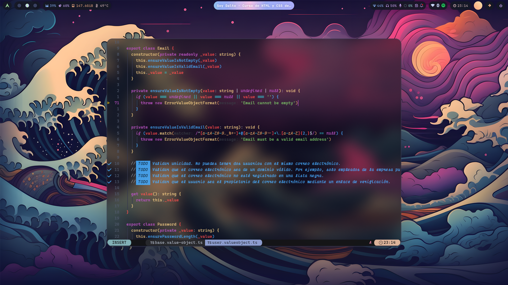

<h1 align="center">My personal dotfiles for Hyprland</h1>

My personal dotfiles for Hyprland


<br>

<h3 align="center">Screenshots</h3>

<hr>

<details><summary>Neofetch</summary>


</details>

<details><summary>Spotify</summary>


</details>

<details><summary>Neovim</summary>



</details>

<br>

<h3 align="center">Installation of dependencies</h3>

<hr>

#### Basic dependencies

<details>
  <summary>Pkgs to be installed</summary>
  <ul>
    <li><code>base-devel</code>: base build tools</li>
    <li><code>mtpfs</code>: for media transfer protocol</li>
    <li><code>jmtpfs</code>: for later version supports</li>
    <li><code>gvfs-mtp</code>: for automount and all ( usb android file transfer )</li>
    <li><code>gvfs-gphoto2</code>: for picture transfer protocol</li>
    <li><code>gnome-keyring</code>: for keyring support</li>
    <li><code>jq</code>: for json support</li>
    <li><code>unzip</code>: for archive support</li>
    <li><code>blueman</code>: for bluetooth support</li>
    <li><code>bluez</code>: for bluetooth support</li>
    <li><code>bluez-utils</code>: for bluetooth support</li>
    <li><code>zsh</code>: for zsh shell</li>
  </ul>
</details>

```sh
sudo pacman -Syy \
base-devel \
mtpfs \
gvfs gvfs-mtp gvfs-gphoto2 \
gnome-keyring \
jq unzip unrar \
bluez bluez-utils \
zsh neovim git
```

<h4>Install yay</h4>

```sh
cd /tmp
git clone https://aur.archlinux.org/yay.git
cd yay
makepkg -si
```

#### Necessary dependencies

<details>
  <summary>Pkgs to be installed</summary>
  <ul>
      <li><code>wayland-protocols</code>: Specifications of extended Wayland protocols</li>
  </ul>
</details>

```sh
yay -S base-devel \
hyprland xdg-desktop-portal-hyprland wayland-protocols \
waybar waybar-hyprland wlogout wofi \
hyprpicker wl-clipboard swww swaync swaylock-effects-git grim slurp \
qt5-base qt5-wayland qt6-base qt6-wayland qt5ct qt6ct polkit-gnome \
pipewire pipewire-alsa pipewire-pulse pipewire-jack wireplumber \
brightnessctl playerctl pavucontrol-gtk3 mpd mpd-mpris \
yad blueman network-manager-applet libinput-gestures \
cava kitty starship tty-clock-git btop geany bat cliphist \
reflector \
--needed
```

#### Install dependencies for ZSH

```sh
# install ohmyzsh
sh -c "$(curl -fsSL https://raw.githubusercontent.com/ohmyzsh/ohmyzsh/master/tools/install.sh)" 

# install zsh-autosuggestions
git clone https://github.com/zsh-users/zsh-autosuggestions ${ZSH_CUSTOM:-~/.oh-my-zsh/custom}/plugins/zsh-autosuggestions

# install zsh-syntax-highlighting
git clone https://github.com/zsh-users/zsh-syntax-highlighting.git ${ZSH_CUSTOM:-~/.oh-my-zsh/custom}/plugins/zsh-syntax-highlighting

# install zsh-completions
git clone https://github.com/zsh-users/zsh-completions ${ZSH_CUSTOM:=~/.oh-my-zsh/custom}/plugins/zsh-completions
```

#### Install dependencies for Neovim

```sh
yay -S ripgrep fd azygit

# clone config
git clone https://github.com/Figaarillo/nvim-conifg ~/.config/nvim
```

#### Install dependencies for Tmux

```sh
git clone https://github.com/tmux-plugins/tpm ~/.tmux/plugins/tpm

# To enable tmux plugin manager you neeed to press
# `prefix` + R
# and `prefix` + I
```

#### Extra dependencies

- <kdb>Utils</kdb>

```sh
yay -S \
xdg-user-dirs xdg-utils \
system76-power \
uget tldr tree \
qalculate-gtk qimgv-light \
tumbler tumbler-extra-thumbnailers \
--needed
```

- <kdb>Obs</kdb>

```sh
yay -S obs-studio wlrobs-hg v4l2loopback-dkms v4l2loopback-utils v4l-utils
```

- <kdb>Thunar</kdb>

```sh
yay -S thunar thunar-archive-plugin thunar-shares-plugin thunar-volmam
```

- <kdb>Apps</kdb>

```sh
yay -S discord spotify telegram-desktop
```

- <kdb>Extras</kdb>

```sh
yay -S nemo gamemode g4music visual-studio-code-bin light chromium-wayland-vaapi libreoffice-fresh rlr-git bulky waydroid binder_linux-dkms
```

#### For me

```sh
yay -S lazydocker obsidian 
  ```

```sh
# Magical shell history 
curl --proto '=https' --tlsv1.2 -LsSf https://setup.atuin.sh | sh
```

<br>

<h3 align="center">Customization of fonts, gtk theme, icons & mouse</h3>

<hr>

#### Fonts

```sh
sudo pacman -S \
adobe-source-code-pro-fonts adobe-source-sans-fonts adobe-source-serif-fonts \
cantarell-fonts \
noto-fonts noto-fonts-cjk noto-fonts-emoji \
ttf-cascadia-code ttf-cascadia-code-nerd \
ttf-dejavu \
$(pacman -Ssq ttf-fira) \
ttf-font-awesome \
ttf-hack \
ttf-iosevka-nerd \
ttf-jetbrains-mono ttf-jetbrains-mono-nerd \
ttf-liberation \
ttf-nerd-fonts-symbols-mono \
ttf-opensans \
ttf-roboto \
ttf-victor-mono-nerd
```

```sh
yay -S ttf-twemoji-color ttf-maple
```

```sh
yay -S $(yay -Ssq operator-mono)
```

#### Update font cache

  When you have installed new fonts, you need to update your font cache, so that the new fonts will be used by the system.

```sh
fc-cache -fv
```

#### GTK Theme

```sh
cd ~/Downloads
git clone https://github.com/Fausto-Korpsvart/Tokyonight-GTK-Theme.git
cd Tokyo-Night-GTK-Theme/

# For GTK 3
cp -r themes/Tokyonight-Dark-BL-LB ~/.themes

# For GTK 4
cp -r themes/Tokyonight-Dark-BL-LB ~/.config/gtk-4.0
```

#### Icons

```sh
cd ~/Downloads
git clone https://github.com/Fausto-Korpsvart/Tokyonight-GTK-Theme.git
cd Tokyo-Night-GTK-Theme/
sudo cp -r icons/Tokyonight-Moon /usr/share/icons/
```

#### Mouse

```sh
cd ~/Downloads
git clone https://github.com/EliverLara/Sweet.git -b nova
cd Sweet/
sudo cp -r kde/cursors/Sweet-cursors /usr/share/icons/
```

<br>

<h3 align="center">Customization of  grub, plymouth & sddm</h3>

<hr>

Thanks to [PROxZIMA](https://github.com/PROxZIMA) for the awesome works!

```sh
yay -S boo-grub-git sddm-git boo-sddm-git proxzima-plymouth-git
```

#### Grub

See [PROxZIMA repo](https://github.com/PROxZIMA/boo-grub) for more details.

  1. Edit grub config file

```sh
sudo vim /etc/default/grub
```

  change `#GRUB_THEME=` to `GRUB_THEME="/usr/share/grub/themes/boo/theme.txt"`

  2. Update grub using

```sh
sudo grub-mkconfig -o /boot/grub/grub.cfg
```

  3. Reboot and voila

#### Plymouth

See [PROxZIMA repo](https://github.com/PROxZIMA/proxzima-plymouth) for more details.

```sh
# check if theme exist in dir
sudo plymouth-set-default-theme -l

# optionally you can test the theme by running the script given in repo (plymouth-x11 required)
sudo ./preview.sh 13

# now set the theme (proxzima, in this case) and rebuilt the initrd
sudo plymouth-set-default-theme -R proxzima
```

If you want to use the shutdown animation as boot screen then do the following changes in the `proxzima.script` file.

```diff
- boot = 196;
+ boot = 97;

-   flyingman_image[i] = Image("boot-" + i + ".png");
+   flyingman_image[i] = Image("shut-" + i + ".png");
```

#### SDDM

See [PROxZIMA repo](https://github.com/PROxZIMA/boo-sddm) for more details.

1. Edit sddm config file

```sh
sudo vim /etc/sddm.conf
```

Make the following changes

```conf
[Theme]
Current=boo
```

2. Reboot and voila

<!--   #### Dotfiles -->
<!---->
<!--   ```sh -->
<!--   cd ~/Downloads -->
<!--   git clone https://github.com/PROxZIMA/.dotfiles.git -->
<!--   cd .dotfiles -->
<!-- # cp -r .config .icons .local .mpd .ncmpcpp .scripts ~/ -->
<!-- # cp -r .config .mpd .ncmpcpp .scripts ~/ -->
<!--   cp .face .fonts.conf .dmrc .gtkrc-2.0 ~/ -->
<!--   chmod -R +x ~/.scripts/ -->
<!--   chmod +x ~/.config/hypr/autostart -->
<!--   chmod -R +x ~/.config/wlogout/ -->
<!--   ``` -->
